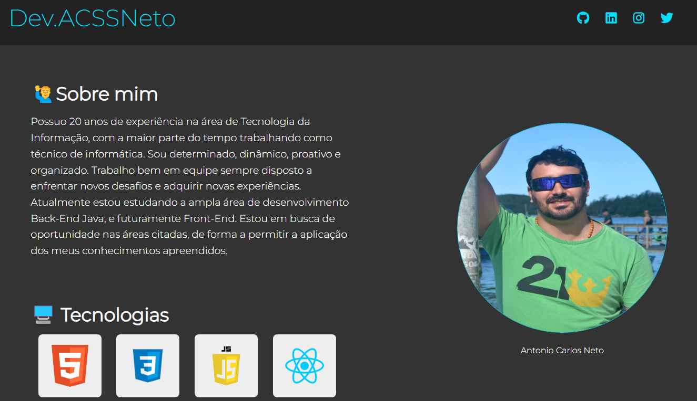

<h1 align="center">Devlinks</h1>

Aprenda os três pilares do desenvolvimento web front-end na prática!.

  <a href="#-tecnologias">Tecnologias</a>&nbsp;&nbsp;&nbsp;|&nbsp;&nbsp;&nbsp;
  <a href="#-projeto">Projeto</a>&nbsp;&nbsp;&nbsp;|&nbsp;&nbsp;&nbsp;
  <a href="#memo-licença">Licença</a>

  

 

  

## 🚀 Tecnologias

Esse projeto foi desenvolvido com as seguintes tecnologias:

- HTML5 e CSS3
- Git e Github
- Importação de fontes

## 💻 Projeto

O Devlinks é um agregador de links para usar como cartão de visitas online.

## :memo: Licença

Esse projeto está sob a licença MIT.

---

Curso ♥ by Luis Antonio de Souza Silva :wave: [Link do Curso!](https://www.udemy.com/course/html5-css3-e-javascript-na-pratica-3-projetos/)
